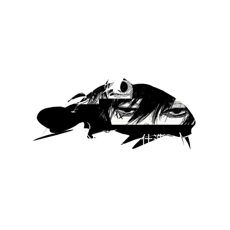
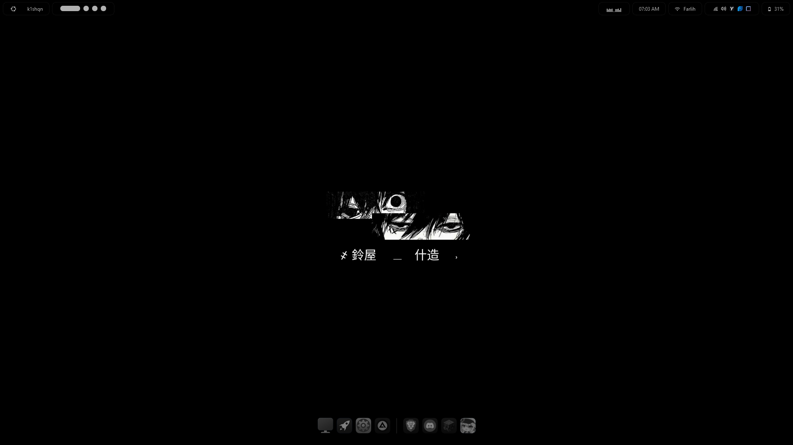
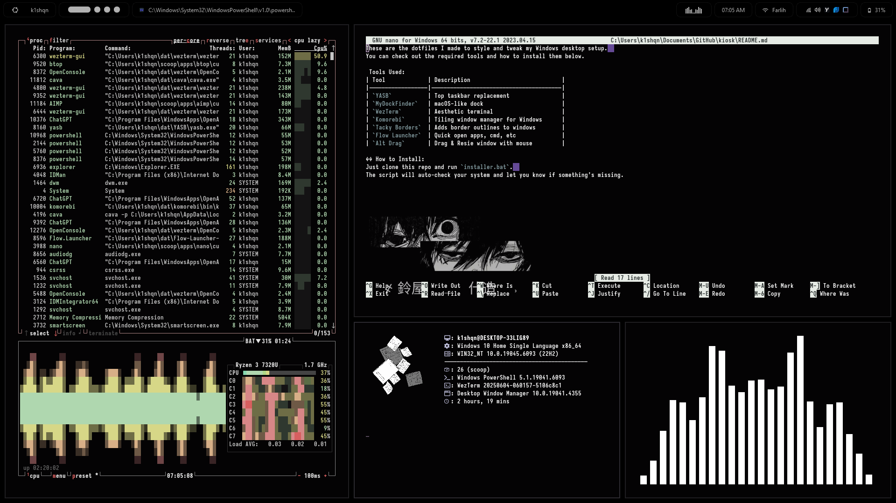
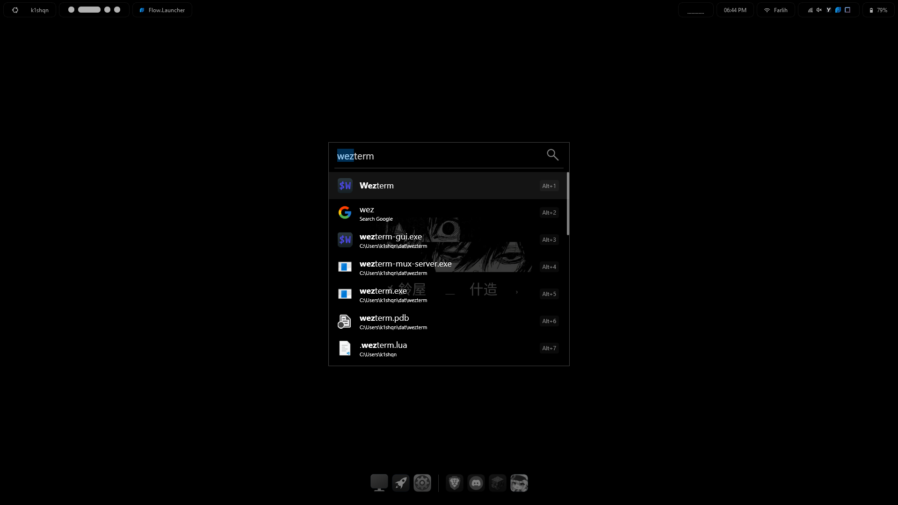

  

  <b>Config/Dotfiles by @k1shqn/b>

&nbsp;

&nbsp;

&nbsp;

&nbsp;

### 😎 Dotfiles:

These are the dotfiles I created to style and tweak my Windows desktop setup.  
You can find the required tools and installation instructions below.

----------------------------------------

### 🛠️ Tools Used:

| Tool             | Description                            |
|------------------|----------------------------------------|
| `YASB`           | Top taskbar replacement                |
| `MyDockFinder`   | macOS-like dock                        |
| `WezTerm`        | Aesthetic terminal                     |
| `Komorebi`       | Tiling window manager for Windows      |
| `Tacky Borders`  | Adds border outlines to windows        |
| `Flow Launcher`  | Quickly open apps, commands, etc.      |
| `Alt Drag`       | Drag & resize windows with the mouse   |

----------------------------------------

- **Manual Install**
  - Copy all files inside each folder and paste them with the exact same names:
    - YASB: `%username%/.config/yasb`
    - MyDockFinder: Paste into your Steam data folder if you downloaded it from Steam. If you have a cracked version, paste into that folder instead.
    - WezTerm: `%username%`
    - Tacky Borders: `%username%/.config/tacky-borders`
  - Copy my setting apps
    - [Flow Launcher](assets/ss/flowlauncher.png): theme quick open apps
    - [Alt Drag](assets/ss/altdrag.png): Copy all my settings (also this is optional)

----------------------------------------

### 📷 Screenshots:

